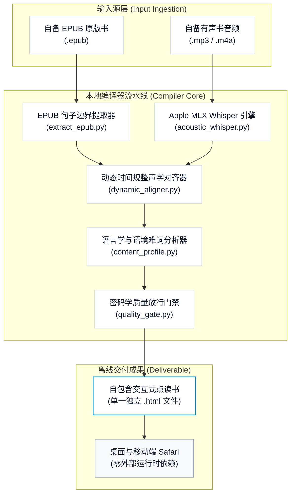

# Bilingual Audiobook Compiler (双语有声书编译器)

<p align="center">
  <b>面向 macOS 与 Apple Silicon 原生打造的本地离线交互式双语有声书编译器与 Apple Books 级排版引擎。</b><br>
  <i>自备 EPUB 原版书与有声书音频，单行命令本地秒级编译；单文件离线 HTML，断网秒开，私密且纯粹。</i>
</p>

<p align="center">
  <a href="README.md"><b>简体中文</b></a> | <a href="README_EN.md">English</a>
</p>

<p align="center">
  <a href="https://apple.com"></a>
  <a href="https://apple.com"></a>
  <a href="https://github.com/ml-explore/mlx"></a>
  <a href="https://python.org"></a>
  <a href="LICENSE"></a>
</p>

---

## 核心设计理念：为什么做这个工具？

我做这个工具的初衷，源自自己在英文深度精读中对“专注力”与“学习科学”的切实探索：

1. **视听双轨协同，锁定深度专注**：单纯阅读容易走神，单纯听书容易滑水。而在阅读文本的同时聆听专业录音室的原声朗读，双感官通道协同输入，能让大脑迅速进入高度专注的沉浸心流。
2. **动态跳动高亮，视觉流动锚定**：伴随朗读节奏实时跳动的单词高亮，为眼球提供了精准的视觉锚点。它让视觉焦点紧紧咬住听觉流动，彻底杜绝“听着听着不知道读到哪”或“视线溜号走神”的脱节痛点。
3. **纯英阅读模式：引入“必要的难度 (Desirable Difficulty)”**：默认纯英文浸润，不让大脑过早依赖中文译文这一拐杖。通过给大脑施加适度而必要的认知负荷，逼迫大脑在纯英语境中直接建立语义联结与原语语感。
4. **按需双语模式：精准为大脑减负**：学习需要挑战，但也需要保护持续性。系统支持随时一键展开双语对照或逐句点读，在遭遇晦涩长难句或认知过载时即时为大脑减负，让精读兼具挑战与从容。
5. **语境地道翻译与高阶生词解析**：摒弃生硬呆板的字面机翻，提供高度契合图书叙事语境的地道中文译文；结合词性、国际音标 (IPA) 与 CEFR C1/C2 词汇解析，帮助读者在具体上下文中真正吃透核心短语与生词。

**Bilingual Audiobook Compiler 的解法是：回归本地与极简。**  
通过 Apple Silicon 统一内存运行 MLX 神经对齐，将任意 EPUB 与音频在本地极速编译为单一纯静态 `.html` 文件。无需安装数据库，无需启动本地 Web 服务器，双击即可在 Safari 中享受顶级 Apple Books 质感的沉浸式精读体验。

> [!NOTE]
> 编译产物为完全自包含的单文件 HTML。支持通过 AirDrop 直接发送至 iPhone / iPad 上的 Safari 离线阅读，无任何外部网络请求与追踪代码。

---

## 交互体验与视觉规格


- **毫秒级单词声学高亮 (Acoustic Tracking)**：文字高亮与专业录音室原声朗读严密同步，告别音频与视觉漂移。
- **语境级词汇与难句浮层 (Nuance Cards)**：点击任意句子即刻展开地道译文、CEFR C1/C2 高阶生词剖析、国际音标 (IPA) 及词性说明。
- **Apple Books 级系统美学**：原生集成 San Francisco 与 New York 衬线字体族，严格遵循 44px 苹果人机交互触控标准，提供纯白（Light）、暖黄羊皮纸（Sepia）与 OLED 纯黑（Dark）三种主题无缝切换。

---

## Apple Silicon 硬件加速性能矩阵

文本解析与单文件 HTML 编译核心完全基于 Python 3 原生标准库，无需任何外部三方包。声学对齐直接调用 Apple 官方 `mlx-whisper`，全面调度 Mac 统一内存架构、GPU 与神经网络引擎 (Neural Engine)，彻底告别庞大的 CUDA 运行库与高昂的云端 API 计费。

| 运行平台 | 音频时长 | 本地对齐耗时 | 处理吞吐效率 | 云端 API 费用 |
| :--- | :---: | :---: | :---: | :---: |
| **Apple M4 / M3 Max (统一内存架构)** | 1 小时专业录音 | **~2.2 分钟** | **~27 倍速实时** | **$0.00 (完全离线)** |
| **Apple M3 / M2 Pro** | 1 小时专业录音 | **~3.5 分钟** | **~17 倍速实时** | **$0.00 (完全离线)** |
| **Apple M1 / M2 Air** | 1 小时专业录音 | **~4.8 分钟** | **~12 倍速实时** | **$0.00 (完全离线)** |
| 云端 GPU / REST ASR API 方案 | 1 小时专业录音 | ~6–10 分钟 + 网络延迟 | ~7 倍速实时 | $0.36 – $1.20 / 本 |

---

## 编译系统拓扑架构



---

## 30 秒极速上手

仓库已内置 5KB 极简公共版权示范书籍（《孙子兵法》英译版），5 秒内即可完成完整编译验证：

```bash
# 1. 克隆编译器仓库
git clone https://github.com/chase-yuan/bilingual-audiobook-compiler.git
cd bilingual-audiobook-compiler

# 2. 编译示范书籍（纯标准库运行，零额外依赖）
python3 universal_runner.py demo/sample.epub --text-only
```

编译完成后系统将自动唤起 Safari，呈现生成的单文件交互式双语书。

---

## 双模式编译指南

### 模式 1：纯文本双语精读器 (`--text-only`)
适用于仅有电子书、暂无音频的场景。极速生成包含逐句点击翻译、语法词汇释义浮层与全键盘快捷键的单文件精排电子书：

```bash
# 基础运行（自动识别输出目录）：
python3 universal_runner.py /path/to/book.epub --text-only

# 多核并行加速翻译（如 8 进程）：
python3 universal_runner.py /path/to/book.epub --text-only --concurrency 8 --book-dir ./my_book
```

### 模式 2：沉浸式有声对齐点读书 (`complete`)
将 EPUB 文本与专业朗读音频（`.mp3` 或 `.m4a`）结合，通过 Apple Silicon 运行逐词级毫秒强制对齐：

```bash
# 安装 Apple Silicon 原生 MLX 声学支持：
pip install -e '.[acoustic]'

# 编译完整有声点读书：
python3 universal_runner.py --epub /path/to/book.epub --audio-dir /path/to/audio --book-dir ./my_book
```

---

## CLI 全局安装

支持安装到本地 Python 环境，在 Mac 任意目录下通过 `bilingual-compiler` 命令快速编译：

```bash
# 基础安装（纯文本编译模式）
pip install -e .

# 完整安装（启用 Apple Silicon MLX 神经对齐）
pip install -e '.[acoustic]'
```

安装后即可直接执行：

```bash
bilingual-compiler /path/to/book.epub --text-only
```

---

## 资源目录组织契约

准备自备的书籍与音频目录结构：

```text
my_book/
  book.epub
  audio/
    00_preface.mp3
    01_chapter1.mp3
    02_chapter2.mp3
```

流水线会自动解析章节前缀与 EPUB 内部 Spine 结构并进行双向绑定，确保整本书音频与文字的严格单调递增，杜绝章节错配。

---

## 质量验证体系

运行包含 121 项断言的完整单元测试矩阵（覆盖边界提取、时间对齐、Token 渲染与打包契约）：

```bash
python3 -m unittest discover
```

---

## 模块清单与职责

- `universal_runner.py`：主编译器 CLI 入口 (`bilingual-compiler`)
- `extract_epub.py`：EPUB 句子级纯净边界提取器
- `dynamic_aligner.py`：高精度动态时间规整声学对齐引擎
- `html_builder.py`：Apple Books 级单文件静态 HTML 编译器
- `content_profile.py`：工作模式分发器 (`text_only` vs `complete`)
- `quality_gate.py`：密码学完整性 release 门禁与烟雾测试
- `validate_outputs.py`：交付产物不变式合规校验器
- `acoustic_whisper.py`：Apple Silicon MLX Whisper 单词级特征提取器
- `demo/sample.epub`：5KB 公版示范 EPUB
- `docs/images/`：交互流程实机 GIF 与视觉资源
- `setup.py`：Python 包配置与全局命令安装契约
- `LICENSE`：MIT 开源协议

---

## 开源协议

本项目基于 [MIT License](LICENSE) 协议完全开源。
