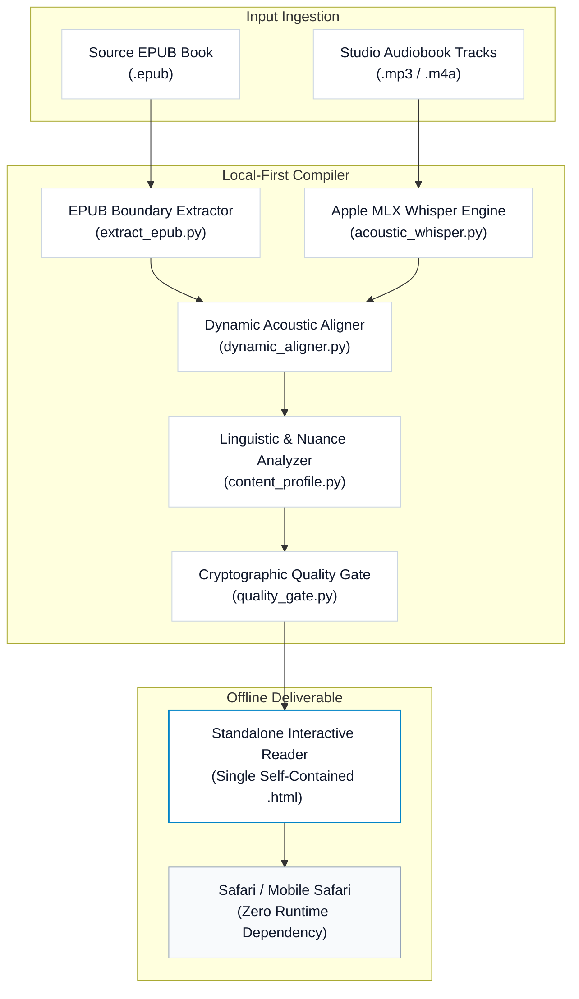

# Bilingual Audiobook Compiler

<p align="center">
  <b>A local-first interactive bilingual audiobook compiler and Apple Books-grade reader engine, engineered natively for macOS and Apple Silicon.</b>
</p>

<p align="center">
  <a href="README.md">简体中文</a> | <a href="README_EN.md"><b>English</b></a>
</p>

<p align="center">
  <a href="https://apple.com"></a>
  <a href="https://apple.com"></a>
  <a href="https://github.com/ml-explore/mlx"></a>
  <a href="https://python.org"></a>
  <a href="LICENSE"></a>
</p>

---

Bring your own EPUB book and audio narration. Compile an offline, self-contained, Apple Books-grade interactive reading application in seconds. Zero servers, zero cloud subscription, zero runtime dependencies.

> [!NOTE]
> The compiled reader is a standalone, single-file HTML document. Open it directly in Safari on Mac, iPad, or iPhone. Works 100% offline with zero external network requests.

---

## Core Design Philosophy: Why Build This Tool?

This project was born out of a personal exploration into focus and cognitive learning science during deep bilingual reading:

1. **Dual-Modal Immersion for Laser Focus**: Reading alone often leads to mind-wandering; passive listening often leads to zone-outs. By reading the text while simultaneously listening to studio narration, dual-channel sensory input locks cognitive bandwidth into deep, sustained immersion.
2. **Kinetic Word Tracking as a Visual Anchor**: Real-time highlighting that dynamic leaps word-by-word with the audio narration provides an unshakeable visual anchor, completely eliminating the cognitive friction of losing one's place or trailing off.
3. **Pure English Mode: Embracing "Desirable Difficulty"**: By keeping the interface in pure English by default, the brain is deprived of premature crutches. This introduces the cognitive psychological concept of *desirable difficulty*, training the mind to process English directly in context.
4. **On-Demand Bilingual Mode: Dynamic Cognitive Unloading**: Effective learning requires challenge without burnout. The reader allows seamless toggle between pure English and sentence-level bilingual translation on demand, unloading cognitive fatigue during dense chapters.
5. **Contextual Idiomatic Translation & Nuance Breakdown**: Moving beyond rigid machine translation, nuance cards provide literary-grade idiomatic translations alongside CEFR C1/C2 vocabulary annotations, parts of speech, and phonetic IPA transcripts, helping readers truly absorb vocabulary in its living context.

---

## Interactive Experience


- **Acoustic Tracking**: Real-time word highlighting locked to studio audiobook narration with sub-millisecond precision.
- **Contextual Nuance Cards**: Click any sentence for idiomatic translations, CEFR C1/C2 vocabulary breakdowns, and phonetic IPA annotations.
- **Apple Books Typography**: San Francisco and New York serif type stacks, 44 px touch targets, and instant Light, Sepia, and OLED Dark mode switching.

---

## Performance on Apple Silicon

The core text extraction and HTML compilation pipeline runs entirely on native Python 3 standard library modules. Speech-to-text forced alignment executes via Apple's official `mlx-whisper`, utilizing the unified memory architecture, GPU, and Neural Engine without CUDA or cloud API billing.

| Hardware Target | Audio Duration | Alignment Time | Throughput | Cloud API Cost |
| :--- | :---: | :---: | :---: | :---: |
| **Apple M5 / M5 Max (Next-Gen Unified Memory)** | 1 Hour (Studio Audio) | **~1.5 min** | **~40x Real-time** | **$0.00 (Offline)** |
| **Apple M4 / M3 Max (Unified Memory)** | 1 Hour (Studio Audio) | **~2.2 min** | **~27x Real-time** | **$0.00 (Offline)** |
| **Apple M3 / M2 Pro** | 1 Hour (Studio Audio) | **~3.5 min** | **~17x Real-time** | **$0.00 (Offline)** |
| **Apple M1 / M2 Air** | 1 Hour (Studio Audio) | **~4.8 min** | **~12x Real-time** | **$0.00 (Offline)** |
| Cloud GPU / REST ASR API | 1 Hour (Studio Audio) | ~6–10 min + Latency | ~7x Real-time | $0.36 – $1.20 / Title |

---

## Compilation Topology



---

## Quickstart

Build the included public-domain monograph (*Sun Tzu's The Art of War*) in 5 seconds using standard library Python:

```bash
# 1. Clone the compiler repository
git clone https://github.com/chase-yuan/bilingual-audiobook-compiler.git
cd bilingual-audiobook-compiler

# 2. Compile demo book (Zero external dependencies needed)
python3 universal_runner.py demo/sample.epub --text-only
```

Safari will automatically launch with the compiled interactive bilingual book.

---

## Dual Compilation Modes

### 1. Pure Text Reader (`--text-only`)
For volumes without audiobook recordings. Compiles complete chapter-by-chapter bilingual readers with sentence click-to-translate, vocabulary popups, and keyboard navigation.

```bash
# Basic run with auto-detected output directory
python3 universal_runner.py /path/to/book.epub --text-only

# High-throughput parallel translation (8 workers)
python3 universal_runner.py /path/to/book.epub --text-only --concurrency 8 --book-dir ./my_book
```

### 2. Synchronized Audiobook Reader (`complete`)
Combines EPUB text with professional narrator audio tracks (`.mp3` or `.m4a`), executing word-by-word forced alignment via Apple Silicon MLX Whisper.

```bash
# Install Apple Silicon MLX acoustic support
pip install -e '.[acoustic]'

# Compile full interactive audiobook
python3 universal_runner.py --epub /path/to/book.epub --audio-dir /path/to/audio --book-dir ./my_book
```

---

## CLI Installation

Install into your local Python environment to use the `bilingual-compiler` command from any directory:

```bash
# Standard installation (Text-only compiler)
pip install -e .

# Full installation (Apple Silicon MLX acoustic support)
pip install -e '.[acoustic]'
```

Once installed:

```bash
bilingual-compiler /path/to/book.epub --text-only
```

---

## Directory Organization

Prepare your source volume and narration files:

```text
my_book/
  book.epub
  audio/
    00_preface.mp3
    01_chapter1.mp3
    02_chapter2.mp3
```

Tracks are automatically paired with EPUB chapters by numerical prefix or spine ID, ensuring monotonic audio-text alignment.

---

## Verification Matrix

Execute the complete regression test matrix (121 assertions covering parsing, alignment, and packaging):

```bash
python3 -m unittest discover
```

---

## Repository Structure

- `universal_runner.py`: Primary CLI entrypoint (`bilingual-compiler`)
- `extract_epub.py`: Clean EPUB sentence boundary extractor
- `dynamic_aligner.py`: High-precision word-level acoustic aligner
- `html_builder.py`: Apple Books standalone HTML compiler
- `content_profile.py`: Mode router (`text_only` vs `complete` audio)
- `quality_gate.py`: Cryptographic release gate and smoke tester
- `validate_outputs.py`: Invariant validator for compilation
- `acoustic_whisper.py`: Apple Silicon MLX Whisper extractor
- `demo/sample.epub`: Public-domain demo EPUB
- `docs/images/`: Visual assets and flow demonstrations
- `setup.py`: Package configuration and entrypoints
- `LICENSE`: MIT License

---

## License

This project is licensed under the [MIT License](LICENSE).
